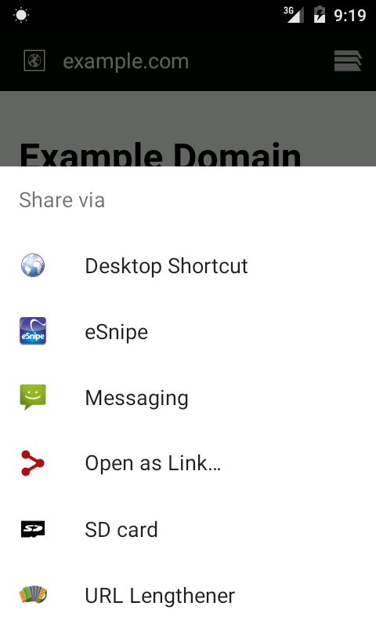
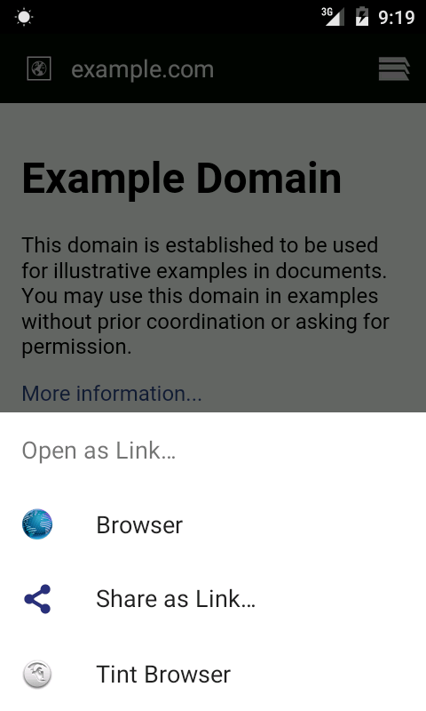
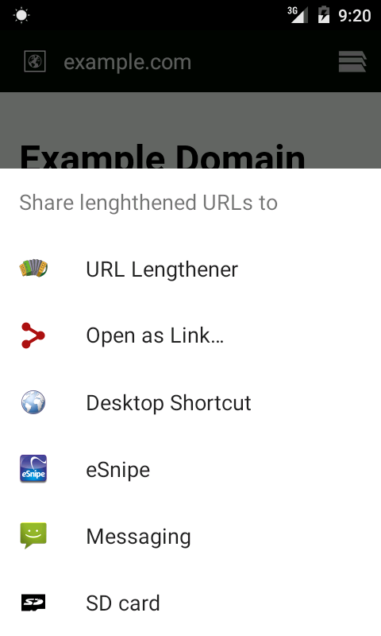

This is an Android tool which helps to convert a Share action to Open and Open to Share.

When you click on a link in a browser or an email 
you may want not to open it in the browser,
but to send it to a chat application.
Just choose "Share as Link..." in the list of applications which are able to open the link,
and then choose the app to share it to.

When you share a link to the article from a news reader application
you may want not to send it somewhere,
but to open it in a browser immediately.
Just choose "Open as Link..." in the list of applications which are able to receive the link,
and then choose the app to open it with.

License
-------

This program is free software: you can redistribute it and/or modify it under the terms of the GNU General Public License as published by the Free Software Foundation, either version 3 of the License, or (at your option) any later version.

This program is distributed in the hope that it will be useful, but WITHOUT ANY WARRANTY; without even the implied warranty of MERCHANTABILITY or FITNESS FOR A PARTICULAR PURPOSE.  See the GNU General Public License for more details.

You should have received a copy of the GNU General Public License along with this program. If not, see http://www.gnu.org/licenses/.
